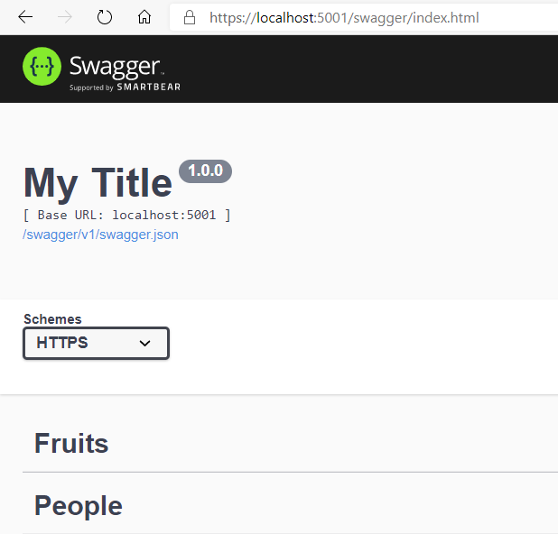
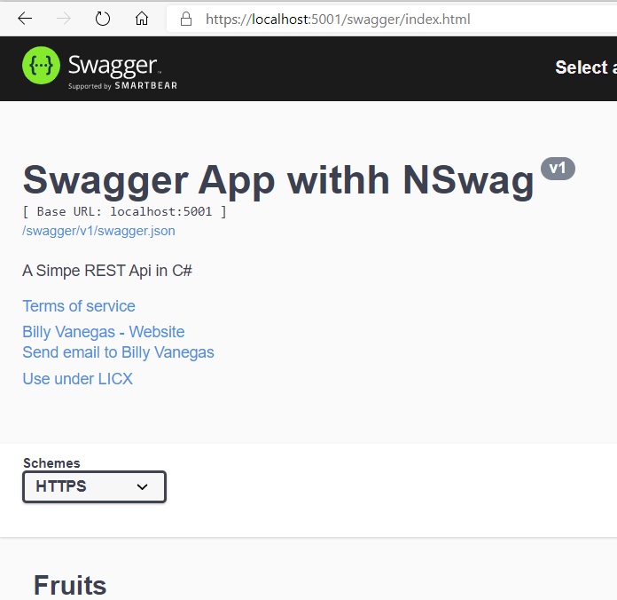

# API Rest en C# y Swagger

## Uso de NSwag para la documentación Swagger

NSwag ofrece las siguientes capacidades:
- Capacidad de usar la interfaz de usuario y el generador de Swagger.
- Capacidad de generar código con flexibilidad.

Con NSwag, no es necesario que exista una API; se pueden usar API de terceros que incluyan Swagger y que generen una implementación de cliente. NSwag permite acelerar el ciclo de desarrollo y adaptarse fácilmente a los cambios de API.

```
Install-Package NSwag.AspNetCore -Version 13.1.6
```


Esta referencia deberá estar en nuestro proyecto: ``` SwaggerApp.csproj ```

```
<PackageReference Include="NSwag.AspNetCore" Version="13.1.6" />
```

## Pasos para insertar NSwag en el código

### 1 - Insertar el código en nuestro de configuración de servicios de la clase Startup :  ``` Startup.ConfigurationServices```

```c#
public void ConfigureServices(IServiceCollection services)
        {
            services.AddDbContext<SampleContext>(options =>
                options.UseInMemoryDatabase("SampleData"));

            services.AddControllers();
		    // Register the Swagger services
            services.AddSwaggerDocument();
        }

```

### 2 - En el metodo de Startup.Configure habilitamos el middleware para servir la especificación y la interfaz de usuario Swagger:

```c#
public void Configure(IApplicationBuilder app, IWebHostEnvironment env)
        {
            // Register the Swagger generator and the Swagger UI middlewares
            app.UseOpenApi();
            app.UseSwaggerUi3();
            // End register

            if (env.IsDevelopment())
            {
                app.UseDeveloperExceptionPage();
            }
            else
            {
                app.UseHsts();
            }

            //app.UseHttpsRedirection();
            app.UseRouting();
            app.UseEndpoints(endpoints =>
            {
                endpoints.MapControllers();
            });
        }
```

### 3 - Construimos

```
dotnet build
```

### 4 - Ejecutamos y navegamos a la url de la API Rest en local:

```
dotnet run
```


La ejecución del código sin el Swagger personalizado




### 5 - Añadimos la personalización Clase Startup.cs ```Startup.ConfigureServices```

```c#
   public void ConfigureServices(IServiceCollection services)
        {
            services.AddDbContext<SampleContext>(options =>
                options.UseInMemoryDatabase("SampleData"));

            services.AddControllers();
            // Register the Swagger services
            services.AddSwaggerDocument(config =>
            {
                config.PostProcess = document =>
                {
                    document.Info.Version = "v1";
                    document.Info.Title = "Swagger App withh NSwag";
                    document.Info.Description = "A Simpe REST Api in C#";
                    document.Info.TermsOfService = "None";
                    document.Info.Contact = new NSwag.OpenApiContact
                    {
                        Name = "Billy Vanegas",
                        Email = "billyvb2004@gmail.com",
                        Url = "https://twitter.com/billy_vanegas"
                    };
                    document.Info.License = new NSwag.OpenApiLicense
                    {
                        Name = "Use under LICX",
                        Url = "https://example.com/license"
                    };
                };
            });
        }
```

### 6 - Salvamos y volvemos a ejecutar el código




## Conclusión 

La utilización de Swagger como generador de documentación de API Rest facilita su comprensión y uso, mantenibilidad.